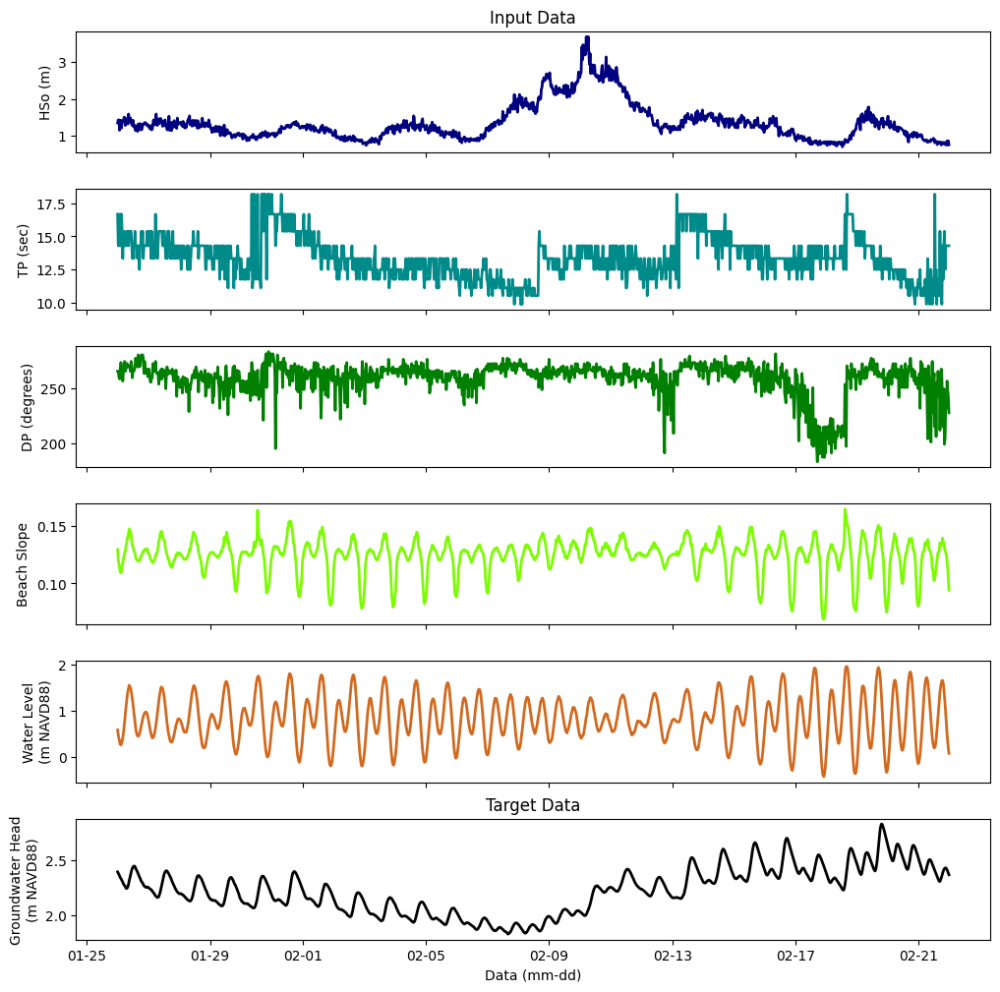

## Overview
In order to predict beach groundwater hydraulic head, an ensemble machine learning approach is appplied using linear regression with ridge regularization and random forrest decision trees. 

***

## Introduction 
Coastal aquifers are highly dynamic groundwater systems which are influenced by coastal water levels.  Sea level fluctuations such as tides, storm surge and wave impacts propagate inland, causing the water table of adjacent unconfined aquifers (i.e., beach groundwater) to oscillate over the first hundred or so meters inland from their interface \cite{nielsen1990tidal, housego2021coastal}. Being able to characterize these fluctuations is crucial, as shallow coastal groundwater levels may result in a number of challenges including groundwater emergence and flooding \cite{befus2020increasing,habel2020sea}, contaminant mobilization \cite{kreibich2008assessment}, subsurface infrastructure damage \cite{habel2017development,knott2017assessing}, and increased liquefaction risk in seismically active regions \cite{abueladas2021liquefaction}. 

Although many analytical and numerical models have been used to explore these interactions, accurate prediction of beach water tables is limited due to the complex, varying topography and geology of coastal regions. Machine learning approaches provide an alternative approach that could allow the development of predictive models without requiring full knowledge of the field site. Recent studies have started to explore the application of machine learning techniques to groundwater forecasting (e.g. Bowes et al., 2019; Roshini et al., 2020); however, these studies look at timescales on the timescales of days to months, and therefore do not capture the shallow groundwater hazards associated with periodically elavated water levels. Additionally, wave conditions are not included in previous models. Along the U.S. West Coast, wave runup significantly increases maximum total coastal water levels \cite{serafin2017relative} and wave impacts are expected to intensify in a changing climate \cite{reguero2019recent, bromirski2023climate}.

This work aims to fill the gaps left by previous studies and assess the ability of supervised machine learning techniques to predict groundwater levels. Groundwater measurements and topographic surveys were conducted in the winter of 2014-2015 at Imperial Beach, CA. Along with publicly availble data of offshore conditions, this allows for the developement of an ensemble machine learning approach.

## Data
Input data features selected for this project are offshore water level (WL), deep water significant wave height (HSo), peak period (TP), peak direction (DP), foreshore beach slope (b). Off-shore wave conditions (HSo, Tp, and DP) at 30 minute intervals are publicly availible through the Coastal Data Information Program's (CDIP, https://cdip.ucsd.edu/) nearest deep water wave buoy (Point Loma South, 191). Water levels at 6 minute intervals are availible through the National Oceanic and Atmospheric Administration's (NOAA, https://tidesandcurrents.noaa.gov/) nearest open coast tide gauge (La Jolla, 9410230). 

Beach topography is taken from an ATV survey conducted February 18th, 2015. Foreshore beach slope varies as water levels move up and down the beach with tides and waves, as the beach face is convex. Therefore, an emperical parameterization of mean water level and wave runup presented by Stockdon et al., 2006 is used to determine the region over which the foreshore beach slope is recorded:

$`bound = 1.1\bigg(0.35b(H_{S0}L_0)^{\frac{1}{2}}\pm\dfrac{[H_{S0}L_0(0.563b^2+0.004)]^{\frac{1}{2}}}{2}\bigg) + WL`$

$`b=\dfrac{y(bound_{upper}) - y(bound_{lower})}{x_(bound{upper}) - x(bound_{lower})}`$

The groundwater head measured at a pressure sensor buried 30m inland from the shoreline is taken to be the target data. All input and target data is interpolated to match the lowest sample rate of 30 minutes in the CDIP data, and normalized to range from 0 to 1.

*Figure 1: Input and target data collected at Imperial beach in February 2015.*

## Modelling
### Feature and Model Selection
In addition to the variables discussed in the previous section, an additional variable calculated as $H_{so}^{1/2}*Tp$ is also included. This value is often used in parameterizations of wave runup on beaches and therefore may play an important role. Additionally, groundwater response lags behind ocean conditions increasingly as you move inland. Analysis of the measured groundwater head found that the water tables at this location typically peaked around 4 hours after the high tide. In order to capture these delayed effects, values of input variable up to 6 hours (12 timesteps) earlier are added as their own feature. The first 12 data points are therefore removed from the dataset. In total, this lead to a feature set of length $(6 * 13) = 78$ features and m = 1284 samples. An ensemble approach using supermized methods is taken by applying linear regression with ridge regularization and decision tress within a random forest regressor. This is done in order to effectively capture both linear and non-linear relationships in the time series. Ensemble approaches also help min For all models, 70% of the samples are used as the training dataset, and 30% are used as the test data set.

### Linear Regression with Ridge Regularization
A supervised linear regression with ridge regularization is implemented using the Ridge function in the SciKitLearn toolbox. This is ment as a first approach to capture any linear relationships in the time series. Ridge regularization is used in order to combat overfitting. Many of the features added as past values of the original variables may not have a strong correlation to the target, as only those features within the timeframe where the forcing has propogated to the measurement location will influence it strongly. Therefore, including a regularization term is crucial for minimizing the parameter weights. 

Ridge regularization implements a cost function that minimizes the square error and the L2 norm. The alpha coefficient determines how heavily weighted the L2 norm is in the cost function. Alpha values ranging from 1 to 20 were tested, with alpha = 10 being selected. This relatively high alpha value minimizes parameter values for features that do not have a strong correlation with the target data. The kfolds cross-validation technique is also implemented. Performance improved until around 9 folds. With lower fold numbers, a larger portion of the dataset is used as the hold-out. With the relatively small sample dataset, the decrease in in samples due to the hold-out with lower fold numbers appears to be more detrimental to model performance than the improvements associated cross-validation.

### Random Forrest 
A supervised random forrest model consisting of decision trees is applied next using the RandomForestRegressor function in the SciKitLearn toolbox. Decision trees for regression estimate target values by progressively splitting data into groups decreasing in size. In this model, the squared error cost function was used to determine the best split. The random forrest model fits many decision trees, and combines the results to produce a final output. The input data used in each decision tree is is varied using bootstrapping, in which a random sample is taken from the original dataset with replacement.

Decision trees are very quick to train and do not require parameter fitting, but they can be prone to overfitting. In order to address this, the maximum depth of the decision tree (largest path from root to leaf) was limited to 8. Using smaller maximum depths resulted in comperable RMSEs, but qualitatively it could be seen that the oscillations in the groundwater head were not captured. The maximum number of features to consider when looking for the best split was also limited to 10, with the goal of ignoring the lagged features with minimal correlations to the target values. The number of decision tree estimators in the random forrest was systematically increased until the RMSE of estimated test data reached a semi-constant value. The final random forest model consisted of 50 decision trees.

### Ensemble Average
In order to combine the results of the two models, the average of the predicted target values calculated using the ridge regularization with kfolds and the random forest was taken. This should allow for the features that each model captures well to be incoorporated into our final estimation.

## Results
*Table 1: Root mean squared errors of the various models when estimating the test data.*

| Model    | Ridge Regularization | Ridge Regularization w/ K Folds | Random Forest | Ensemble Average |
| -------- | -------------------- | ------------------------------- | ------------- | ---------------- |
| RMSE (m) |         0.1580       |             0.1578              |    0.2574     |      0.1351      |

Table 1 shows the RMSE of all the models when applied to the test data. The kfolds cross-validation did not significantly change model performance (RMSE change of <1mm). The linear models with ridge regularization (LR) have significanly lower RMSEs that the Random Forest model (RF). Taking the ensemble average decreased RMSE by 0.0227 when compared to the best original model. Figure 2 shows the comparison and residuals between the predicted and measured groundwater heads. The mean of the residuals using the ensemble average was very close to zero (0.004). The distribution of the residuals is slightly right-skewed, suggesting it is not gaussian. Figure 3 shows the predicted groundwater levels from the test set ploted as a function of time. This allows for a qualitative assessment of the model's ability to reproduce groundwater oscillation patterns.

*Figure 2: Predicted vs measured groundwater heads from test dataset are shown on the left. A histogram of the residuals using the ensable average approach are shown on the right. The black dashed line represents the mean residual value.*

*Figure 3: Predicted groundwater heads from the test data set are plotted with all measured groundwater (shown in black).*

## Discussion
Althought the LR model has a lower RMSE that the RF, the RF model appears to better be able estimate target values when groundwater heads were very low (e.g. Feb 7-9) or high (e.g. Feb 19-22), although both models perform worse during these conditions (Figure 2,3). However, both models perform worst under at these points. Overall, the ensemble average method resulted in the lowest RMSE. This shows the benefits of this approach, as the combination of the comparitively weak RF predictor with the LR model improves overall performance.

The distribution of the ensemble average residuals being skewed to the right suggested that the of the data is underestimated, with a smaller proportion of larger overestimates. This warrants further investigation to ensure the model is not missing any key relationships. Still, the mean of the residuals is very close to zero, suggesting appropriate model fitting.

## Conclusion

Overall, the ensemble average model does a good job at predicting groundwater levels, with RMSEs consistant with or below those typical of complex numerical simulations of beach groundwater head. This provides valuable data. This type of predictive model provides a much needed tool for assessment of shallow beach groundwater hazards, especially in the absense of in-depth geological data or computational resources needed to run numerical simulations. Such models have the potential to make assessment of periodic shallow groundwater hazards more accessible. Future work coud include development of an autoregressive model with exogenous inputs to more directly explore the groundwater head time series (as opposed to individual measurements). Machine learning techniques could also be used to try and develop parameterizations of offshore wave conditions' influences on beach groundwater, as these relationships are not yet understood on wave dominant coastlines such as the U.S. West Coast.

## References
[1] DALL-E 3

[back](./)
